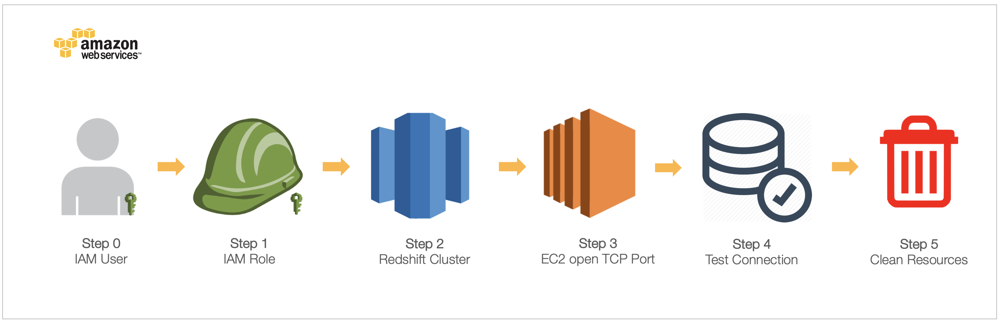
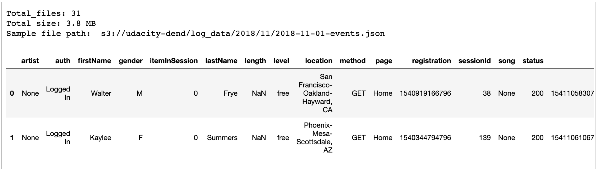

# Sparkify Cloud Data Warehouse on AWS Redshift


## Introduction
A music streaming startup, Sparkify, has grown their user base and song database and want to move their processes and data onto the cloud. Their data resides in S3, in a directory of JSON logs on user activity on the app, as well as a directory with JSON metadata on the songs in their app.


## Description
In this project, data warehouses and AWS to build an ETL pipeline for a database hosted on Redshift. starting from set up AWS service and load data from S3 to staging tables on Redshift then execute SQL statements that create the analytics tables from these staging tables.


## How to run
- STEP 1: Set up AWS on console](https://aws.amazon.com/) or follow IaCs from `aws_setup.ipynb` 
- STEP 2: Run `create_tables.py` to create staging tables and analytics tables (Fact&Dim tables)
- STEP 3: Run `etl.py` to begin ETL process, extract file from S3, load into staging table and tranform data to analytic tables.


## The AWS Set Up

AWS Setup using IaC on `aws_setup.ipynb`
- STEP 0: Save AWS SECRET and access KEY from AWS Console
- STEP 1: Create IAM ROLE / Save the IAM_ROLE_ARN
- STEP 2: Create Redshift Cluster / Save CLUSTER_ENDPOINT
- STEP 3: Open an incoming TCP port to access the CLUSTER_ENDPOINT
- STEP 4: Test Cluster Connection
- STEP 5: Clean up the resources (Only if finished, to reserve the budgets)


## The ETL

After the AWS instances ready, begin the ETL process. 
- STEP 0: Activate S3 service and check data on buckets.
- STEP 1: Extract data from S3 to Redshift as Staging tables.
- STEP 2: Transform and Load data into Analytics tables.
- STEP 3: Explore analytic queries.


## The Dataset on S3
### Song Dataset 
A subset of real data from the [Million Song](https://labrosa.ee.columbia.edu/millionsong/) Dataset. Each file is in JSON format and contains metadata about a song and the artist of that song. The files are partitioned by the first three letters of each song's track ID. For example, here are filepaths to two files in this dataset.

```
song_data/A/B/C/TRABCEI128F424C983.json
song_data/A/A/B/TRAABJL12903CDCF1A.json
```
And below is an example of what a single song file, TRAABJL12903CDCF1A.json, looks like.

```python
{"num_songs": 1, "artist_id": "ARJIE2Y1187B994AB7", "artist_latitude": null, "artist_longitude": null, "artist_location": "", "artist_name": "Line Renaud", "song_id": "SOUPIRU12A6D4FA1E1", "title": "Der Kleine Dompfaff", "duration": 152.92036, "year": 0}
```
### Log Dataset 
This dataset consists of log files in JSON format generated by this [event simulator](https://github.com/Interana/eventsim) based on the songs in the dataset above. These simulate activity logs from a music streaming app based on specified configurations.

The log files in the dataset you'll be working with are partitioned by year and month. For example, here are filepaths to two files in this dataset.

```
log_data/2018/11/2018-11-12-events.json
log_data/2018/11/2018-11-13-events.json
```
And below is an example of what the data in a log file, 2018-11-12-events.json, looks like.




## Project Files

1. **aws_setup.ipynb** The jupyter notebook show how setup AWS using IaC.
2. **create_tables.py** drops and creates tables. prepare them before begin ETL process.
3. **etl.py** ETL Pipeline  to extract data from S3, load and transform into Redshift clusters.
3. **etl.ipynb** The jupyter notebook show step by step before implement them into ETL scripts.
4. **sql_queries.py** contains all sql queries, that used in `create_table.py` and `etl.py` 


## Results


